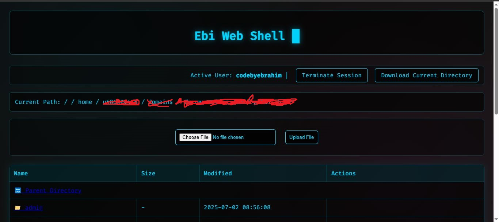
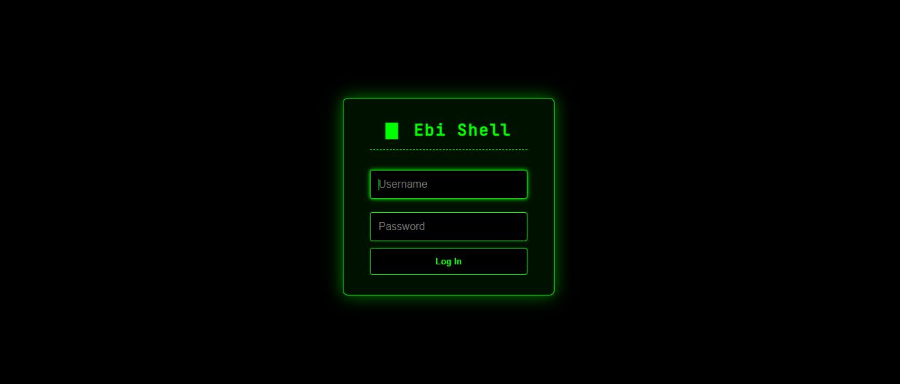
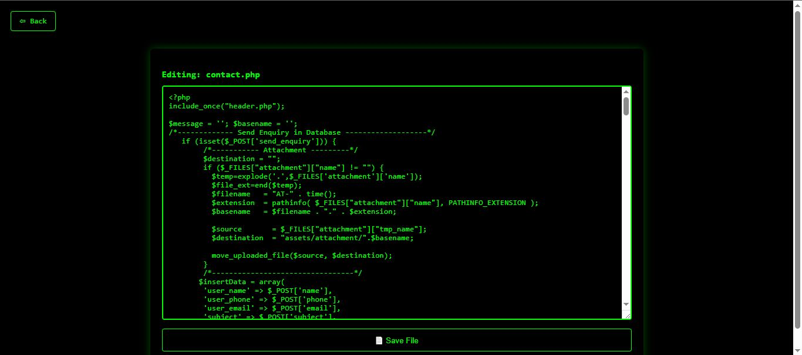
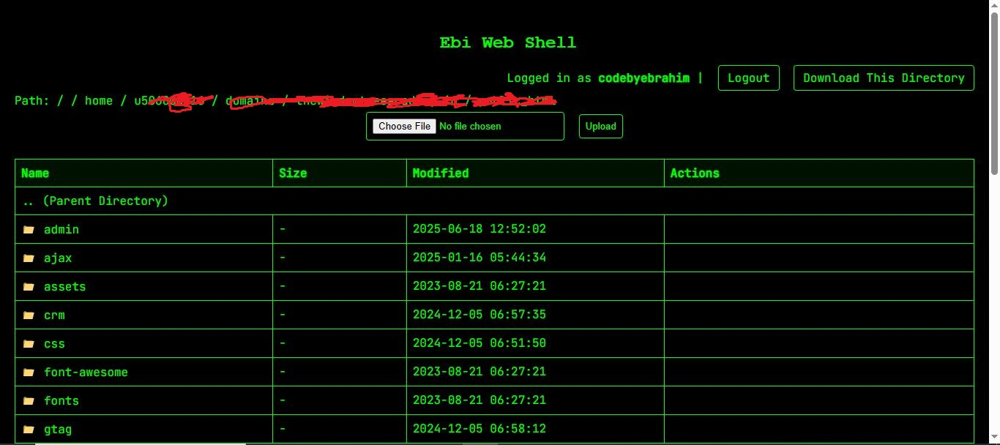

# Ebi Webshell

**EbiWebshell** is a lightweight PHP web shell with a graphical file manager.  
Designed for educational and personal testing purposes.

⚠️ Do **NOT** use this on unauthorized or public servers.  
You are fully responsible for your usage of this tool.

---

## 🔵 Blue Theme

File: `ebishell_b.php`

---

## 🟢 Green Theme (Classic Terminal UI)

File: `ebishell_g.php`

---

## ✨ Features

- Login authentication
- File manager with upload / edit / rename / delete
- Directory download as ZIP
- Dark mode UI (green / blue)
- Lightweight – no dependencies
## 👨‍💻 Author

codebyebrahim
